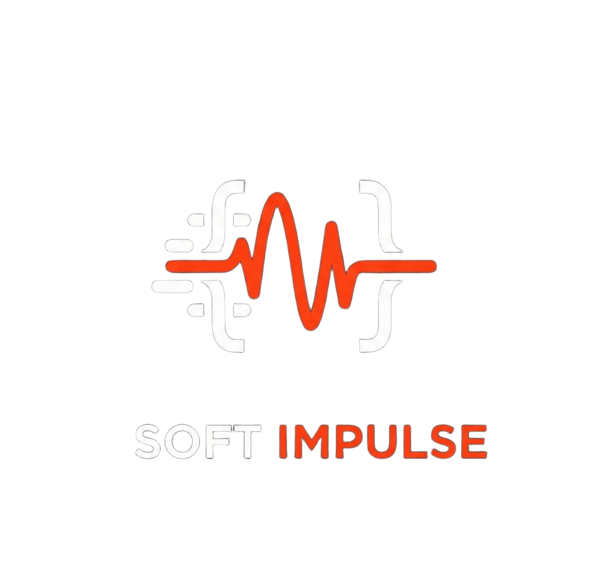

<div align="center">

# 👨‍💻 Nico - Full Stack Developer

[](https://git.io/typing-svg)

<p align="center">
  
  
  
</p>

</div>

---

## 🎯 About Me

> *"Clean code, solid architecture, and zero black magic... unless it compiles on the first try 😌"*

I'm a **Full Stack Developer** specialized in building **robust, scalable web applications and software** with a strong focus on delivering real business results. I work across the entire stack—from frontend to backend—integrating design, logic, performance, and continuous maintenance into cohesive solutions.

### 🏢 Currently Working With

<table>
<tr>
  <td align="center" width="50%">
    <a href="https://nexobyte.com.ar" target="_blank">
      
    </a>
    <br/>
    <sub><b>Enterprise Solutions</b></sub>
  </td>
  <td align="center" width="50%">
    <a href="https://softimpulse.net" target="_blank">
      
    </a>
    <br/>
    <sub><b>Custom Software Development</b></sub>
  </td>
</tr>
</table>

---

## 🛠️ Technology Stack

<details open>
<summary><b>💻 Languages</b></summary>
<br/>


</details>

<details open>
<summary><b>⚙️ Frameworks & Libraries</b></summary>
<br/>


</details>

<details open>
<summary><b>🗄️ Databases</b></summary>
<br/>


</details>

<details open>
<summary><b>🛠️ Tools & Environment</b></summary>
<br/>


</details>

---

## 💼 What I Do

```typescript
const developer = {
  name: "Nico",
  role: "Full Stack Developer",
  expertise: [
    "🎨 Full Stack Web Application Development",
    "⚡ RESTful API Design & Implementation",
    "🔐 Secure Authentication & Authorization Systems",
    "📊 Administrative Dashboards & Management Panels",
    "🔄 Third-Party Service Integrations",
    "🚀 Performance Optimization & Scalability",
    "🛠️ Continuous Maintenance & Technical Support"
  ],
  currentFocus: "Building scalable enterprise solutions",
  availability: "Open to freelance projects & collaborations"
};
```

---

## 🎯 Core Competencies

<table>
<tr>
  <td valign="top" width="33%">

### 🎨 Frontend
- Responsive Web Design
- Modern UI/UX Implementation
- Component-Based Architecture
- State Management
- Performance Optimization

  </td>
  <td valign="top" width="33%">

### ⚙️ Backend
- RESTful API Development
- Database Design & Optimization
- Authentication & Authorization
- Server-Side Logic
- Full-Stack Backend Solutions

  </td>
  <td valign="top" width="33%">

### 🚀 DevOps & Tools
- Version Control (Git)
- CI/CD Pipelines
- API Testing & Documentation
- Cloud Deployment
- System Administration

  </td>
</tr>
</table>

---

## 📊 GitHub Statistics

<div align="center">
  
  
</div>

<div align="center">
  
</div>

---

## 🐍 Contribution Activity

<div align="center">
  
</div>

---

## 🏆 Featured Projects

<div align="center">

| Project Type | Description | Technologies |
|-------------|-------------|--------------|
| 🏢 **Enterprise Systems** | Custom web applications for businesses and startups | Full Stack, APIs, Database Design |
| 🔐 **Admin Platforms** | Management dashboards with authentication and role-based access | Node.js, Express, PostgreSQL |
| ⚡ **Performance-Focused Apps** | Applications built for speed, stability, and scalability | Optimization, Caching, Load Balancing |
| 🔄 **Continuous Development** | Ongoing development and technical support for production systems | Maintenance, Updates, Monitoring |

</div>

---

## 📫 Get In Touch

<div align="center">

[](https://github.com/Nicoo01x)
[](https://softimpulse.net)
[](mailto:contact@softimpulse.net)

</div>

---

<div align="center">

### 💡 *"Code is like humor. When you have to explain it, it's bad."* – Cory House

<br/>


<br/>

⭐ **If any of my projects help or inspire you, stars don't bite (and they motivate quite a bit)!**

<br/>

---

<sub>Built with ❤️ and ☕ by Nico | Last Updated: January 2026</sub>

</div>
