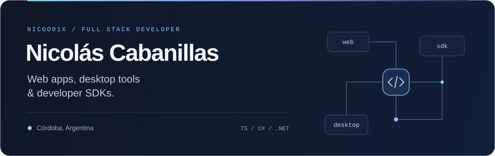

  

  <a href="https://softimpulse.net">Soft Impulse</a>
  &nbsp; / &nbsp;
  <a href="https://nexobyte.com.ar">Nexobyte</a>
  &nbsp; / &nbsp;
  <a href="mailto:contact@softimpulse.net">Get in touch</a>

 

### Hey, I'm Nico.

I'm a **full stack developer from Córdoba, Argentina**, working on projects at **[Soft Impulse](https://softimpulse.net)** and **[Nexobyte](https://nexobyte.com.ar)**. I build web applications, Windows tools, and SDKs that make integrations easier.

My work spans **TypeScript / Node.js** and **C# / .NET**, from the interface to the services behind it. Here you'll find peer-to-peer software, tools for the Argentine developer ecosystem, and a few experiments along the way.

 

### Selected projects

<table>
  <tr>
    <td width="50%" valign="top">
      <h3><a href="https://github.com/Nicoo01x/SyncBeam">↗ SyncBeam</a></h3>
      
<strong>Your files. Your devices.</strong>

      
Peer-to-peer file transfers and clipboard sync for Windows, with automatic device discovery and encrypted connections.

      
<code>C#</code> <code>.NET</code> <code>WPF</code>

      
<a href="https://github.com/Nicoo01x/SyncBeam">Source</a> · <a href="https://github.com/Nicoo01x/SyncBeam/releases">Releases</a>

    </td>
    <td width="50%" valign="top">
      <h3><a href="https://github.com/Nicoo01x/Arca">↗ Arca</a></h3>
      
<strong>Less SOAP. More building.</strong>

      
A Node.js SDK for Argentina's ARCA / AFIP services: authentication, electronic invoicing, and taxpayer lookup through a typed API.

      
<code>TypeScript</code> <code>Node.js</code> <code>SDK</code>

      
<a href="https://github.com/Nicoo01x/Arca">Source &amp; documentation</a>

    </td>
  </tr>
  <tr>
    <td width="50%" valign="top">
      <h3><a href="https://github.com/Nicoo01x/OmniChannel-SDK">↗ OmniChannel SDK</a></h3>
      
<strong>Multiple channels. One interface.</strong>

      
A shared notification API for WhatsApp, email, and SMS, with extensible providers, TypeScript types, and zero runtime dependencies.

      
<code>TypeScript</code> <code>Node.js</code> <code>SDK</code>

      
<a href="https://github.com/Nicoo01x/OmniChannel-SDK">Source &amp; documentation</a>

    </td>
    <td width="50%" valign="top">
      <h3><a href="https://github.com/Nicoo01x/CuitOnline-NPMjs">↗ CuitOnline</a></h3>
      
<strong>Lookups, ready for your backend.</strong>

      
A Node.js client for CuitOnline that searches public listings by CUIT, CUIL, DNI, or name and returns structured results.

      
<code>JavaScript</code> <code>Node.js</code> <code>npm</code>

      
<a href="https://github.com/Nicoo01x/CuitOnline-NPMjs">Source &amp; documentation</a>

    </td>
  </tr>
</table>

**Also on my workbench:** [SetupStorm](https://github.com/Nicoo01x/SetupStorm), a Windows automation toolkit · [Enunanota](https://github.com/Nicoo01x/Enunanota), a game experiment for OLGA.

 

### Tools I work with

| Area | Technologies |
| :--- | :--- |
| **Web** | TypeScript · JavaScript · React · HTML · CSS |
| **Backend & desktop** | Node.js · Express · C# · .NET |
| **Data** | PostgreSQL · MongoDB · MySQL · SQL Server |
| **Workflow** | Git · Docker · Linux · Postman |

  
More languages I've worked with

   
  C++ · Python · Lua · PHP · SQL

 

### Between commits

<picture>
  <source media="(prefers-color-scheme: dark)" srcset="https://raw.githubusercontent.com/Nicoo01x/Nicoo01x/output/github-contribution-grid-snake-dark.svg" />
  <source media="(prefers-color-scheme: light)" srcset="https://raw.githubusercontent.com/Nicoo01x/Nicoo01x/output/github-contribution-grid-snake.svg" />
  
</picture>

 

---

  <strong>Have something in mind? Let's talk.</strong> 
  <a href="mailto:contact@softimpulse.net">contact@softimpulse.net</a>

Córdoba, Argentina &nbsp; · &nbsp; Español / English

